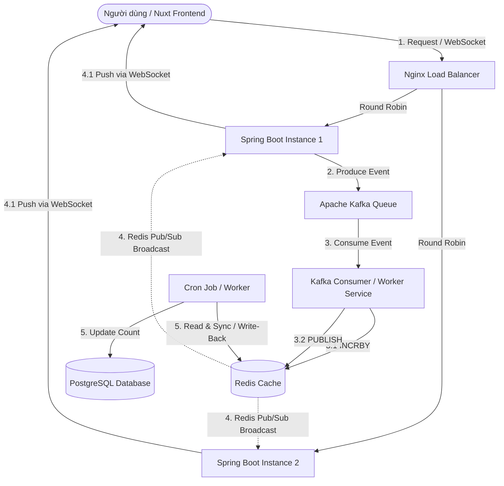

# Live Analytics Counter (Hệ thống Đếm lượt xem thời gian thực)

Dự án thiết kế hệ thống (System Design) giải quyết bài toán tải cao (Write-heavy) và truyền thông thời gian thực (Real-time communication).

---

## 📌 Tổng quan bài toán

Hệ thống cho phép đếm lượt xem (views), lượt thích (likes), hoặc tương tác của video/bài viết theo thời gian thực với lượng truy cập cực kỳ lớn. Thiết kế tập trung vào việc giảm tải cho Database (SQL) bằng cơ chế xếp hàng đợi (Message Queue) kết hợp Caching (Write-back) và phân phối tin nhắn thời gian thực qua WebSockets (Pub/Sub).

---

## 🏗️ Kiến trúc hệ thống & Luồng dữ liệu



### Chi tiết Luồng dữ liệu:

1. **User xem video:** Nuxt Frontend gửi HTTP Request hoặc kết nối WebSocket thông qua **Nginx Load Balancer** (sử dụng thuật toán Round Robin) tới một trong các **Spring Boot Instances**.
2. **Đẩy Event vào Queue:** Instance nhận request sẽ bắn một event (ví dụ: `video_viewed` với payload `{videoId: 101, userId: 999}`) vào **Apache Kafka** để đảm bảo ghi nhận sự kiện không bị mất mát dữ liệu và phản hồi ngay lập tức cho client (tính không đồng bộ - Asynchronous).
3. **Xử lý bất đồng bộ (Worker):** **Kafka Consumer Worker** lắng nghe và xử lý các events từ Kafka:
   - **Ghi số đếm (Redis INCRBY):** Thực hiện lệnh nguyên tử `INCRBY video:101:views 1` trên Redis. Đây là bước chuẩn bị cho chiến lược **Write-Back** để tránh ghi trực tiếp vào DB SQL.
   - **Phát tin (Redis PUBLISH):** Phát tin nhắn qua Redis Pub/Sub: `PUBLISH video_channel "101:1050"` (Video `101` hiện có `1050` views).
4. **Broadcast Real-time (WebSockets):** Tất cả các Spring Boot Instances (1, 2, ...) đều đang subscribe kênh `video_channel` trên Redis. Khi nhận được tin nhắn từ Redis Pub/Sub, các instance này sẽ tìm các kết nối WebSocket của Nuxt Client tương ứng đang xem video `101` để đẩy số view mới nhất xuống Dashboard.
5. **Đồng bộ về Database (Write-Back):** Cứ mỗi 10 giây (hoặc chu kỳ cấu hình), một **Cronjob** chạy ngầm sẽ quét các key có dữ liệu thay đổi trên Redis và cập nhật giá trị tổng về **PostgreSQL Database**.

---

## 🛠️ Tech Stack & Môi trường

- **Backend API (Ingestion & Worker):** Spring Boot
- **Message Broker:** Apache Kafka
- **Caching / In-Memory Storage:** Redis (INCRBY, Redis Pub/Sub)
- **Database (Persist):** PostgreSQL
- **Real-time Gateway:** WebSockets (Spring Boot WebSocket)
- **Frontend:** Nuxt.js
- **Load Balancer & Reverse Proxy:** Nginx (Round Robin)
- **Containerization:** Docker & Docker Compose

---

## 🧠 Đánh giá & Lưu ý thiết kế (Design Considerations)

Dưới đây là một số điểm đánh giá kiến trúc này đã rất hợp lý và một số lưu ý kỹ thuật cần xử lý khi triển khai thực tế:

### 1. Điểm mạnh của thiết kế

- **Giảm tải Database tuyệt đối:** Cơ chế **Write-Back (Write-Behind)** giúp gộp hàng ngàn lượt ghi trên RAM (Redis) thành 1 câu lệnh UPDATE duy nhất xuống PostgreSQL sau mỗi $N$ giây.
- **Mở rộng dễ dàng (Scalability):** Do các kết nối WebSockets là stateful (giữ kết nối), việc sử dụng **Redis Pub/Sub** đóng vai trò là "chất keo" giúp đồng bộ tin nhắn giữa các Spring Boot instance. Dù Client A kết nối tới Instance 1 và Client B kết nối tới Instance 2, cả hai đều sẽ nhận được cập nhật khi có event view mới được publish từ bất kỳ worker nào.
- **Đảm bảo tính bền vững (Durability):** Kafka hoạt động như một WAL (Write-Ahead Log) lưu trữ các sự kiện một cách bền bỉ trên đĩa cứng, giúp hệ thống không bị mất mát dữ liệu tương tác ngay cả khi Redis bị sập đột ngột.

### 2. Chi tiết các giải pháp tối ưu khi triển khai code

#### A. Quản lý các key thay đổi (Dirty Keys) cho Write-Back

- **Vấn đề:** Lệnh `KEYS *` hoặc `KEYS video:*:views` có độ phức tạp $O(N)$ và chạy đơn luồng trên Redis. Khi hệ thống lớn, lệnh này sẽ gây block toàn bộ Redis và làm sập ứng dụng.
- **Giải pháp:** Sử dụng một **Redis Set** để gom các ID video có biến động dữ liệu.
- **Luồng hoạt động:**
  1. Khi Kafka Consumer xử lý sự kiện xem video `101`, ta thực hiện đồng thời:
     ```redis
     INCRBY video:101:views 1
     SADD dirty_videos 101
     ```
  2. Khi Cronjob đồng bộ chạy (định kỳ 10 giây):
     - Sử dụng `SPOP` để lấy ra danh sách các video đã bị thay đổi (giới hạn số lượng mỗi lô để tránh quá tải):
       ```redis
       SPOP dirty_videos 100
       ```
     - Giả sử nhận được danh sách `[101, 105, 200]`. Cronjob chỉ cần gọi `MGET` để lấy số lượng view cụ thể của các video này:
       ```redis
       MGET video:101:views video:105:views video:200:views
       ```
     - Tiến hành đồng bộ các giá trị này vào cơ sở dữ liệu PostgreSQL.

#### B. Xử lý Race Condition khi cập nhật PostgreSQL (UPSERT)

- **Vấn đề:** Nếu ta đọc số lượng view hiện tại từ DB lên Spring Boot, cộng thêm số view mới tích lũy được từ Redis rồi ghi đè lại DB, khi nhiều instance/thread chạy song song sẽ ghi đè đè lẫn nhau làm mất mát số liệu (Lost Update).
- **Giải pháp:** Sử dụng câu lệnh `UPSERT` nguyên tử (Atomic Update) trực tiếp dưới database thông qua từ khóa `ON CONFLICT DO UPDATE`.
- **Mẫu SQL tối ưu:**
  ```sql
  INSERT INTO video_analytics (video_id, views)
  VALUES (101, 10)
  ON CONFLICT (video_id)
  DO UPDATE SET views = video_analytics.views + EXCLUDED.views;
  ```
  _Cách này đảm bảo việc cộng dồn views được khóa và thực thi an toàn ở mức Database Transaction._

#### C. Tối ưu hóa WebSocket Channel (Phòng / Room Pattern)

- **Vấn đề:** Mặc định nếu phát tin qua Redis Pub/Sub và đẩy trực tiếp xuống WebSocket cho mọi Client, người dùng đang xem video `202` vẫn phải nhận event tăng view của video `101`, gây lãng phí băng thông và tài nguyên trình duyệt cực lớn.
- **Giải pháp:** Áp dụng mô hình phòng (Room/Topic Pattern).
- **Luồng hoạt động:**
  1. Khi Nuxt Frontend kết nối WebSocket, gửi một message đăng ký phòng:
     ```json
     { "action": "subscribe", "video_id": "101" }
     ```
  2. Spring Boot Instance lưu danh sách kết nối vào một cấu trúc Map trong bộ nhớ:
     ```java
     Map<String, Set<WebSocketSession>> videoRooms = new ConcurrentHashMap<>();
     // Đưa session của Client vào Set tương ứng với key "101"
     ```
  3. Khi nhận được tin nhắn từ Redis Pub/Sub (`video_channel` payload `101:1050`): Spring Boot lọc ra video ID `101`, tìm trong `videoRooms.get("101")` và **chỉ gửi** thông tin số view mới cho những session nằm trong Set này.
